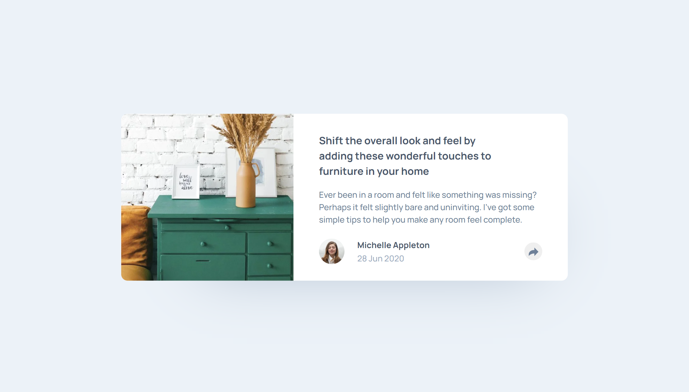

# Frontend Mentor - Article preview component

This is a solution to the [Article preview component challenge on Frontend Mentor](https://www.frontendmentor.io/challenges/article-preview-component-dYBN_pYFT). Frontend Mentor challenges help you improve your coding skills by building realistic projects.

### Difficulty: `newbie`

## Table of contents

- [Overview](#overview)
  - [The challenge](#the-challenge)
  - [Useful resources](#useful-resources)
    - [Author](#author)

## Overview

### The challenge

To build the Article preview component according to the given designs as close as possible.
The users should be able to:
- View the optimal layout for the component depending on their device's screen size
- See the social media share links when they click the share icon

### Useful resources

#### Author

- LinkedIn - [Yari Morcus](https://www.linkedin.com/in/yarimorcus)
- Frontend Mentor - [@YariMorcus](https://www.frontendmentor.io/profile/YariMorcus)